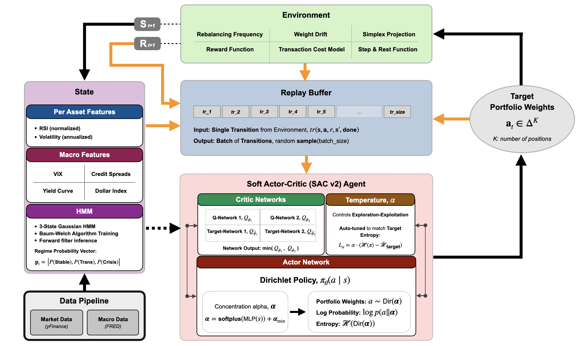
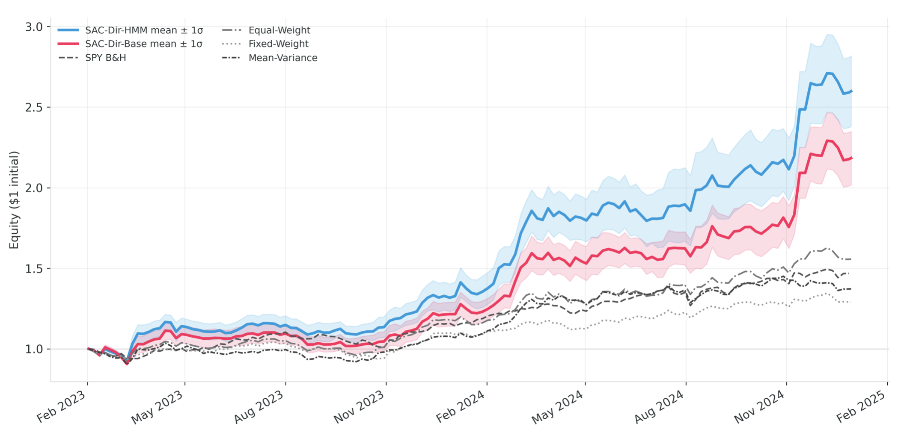
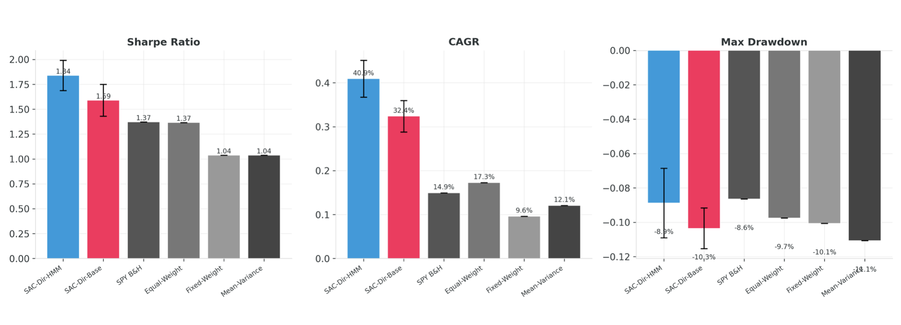
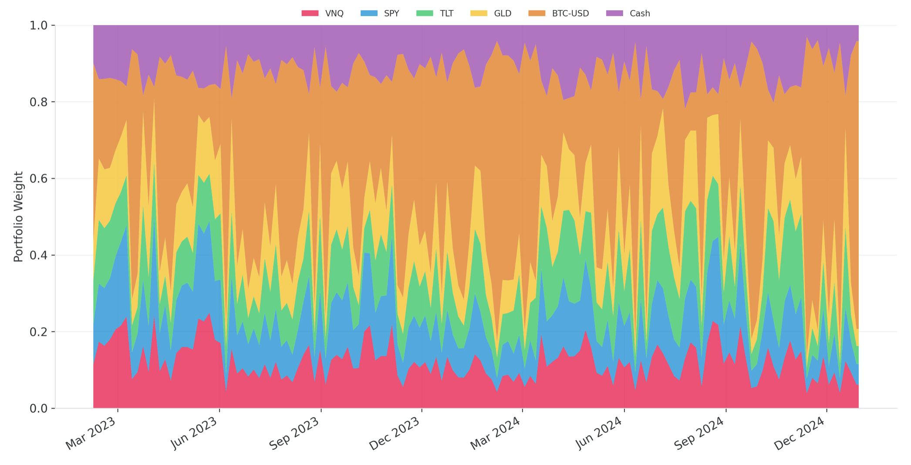
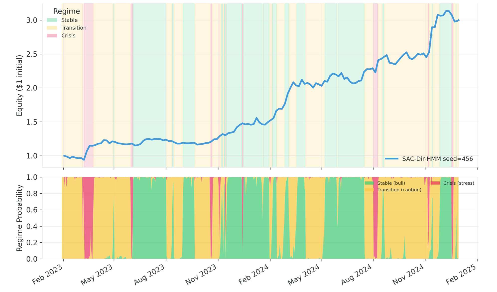

<p align="center">
  
</p>

<h1 align="center">Deep Reinforcement Learning for Quantitative Trading</h1>

<h3 align="center">SAC-Dirichlet Framework with HMM Regime Detection for Constrained Portfolio Optimization</h3>

<p align="center">
  <em>MSAI Master Thesis · Nanyang Technological University · MSAI/25/007</em>
</p>

<p align="center">
  
  
  
  
  
  
</p>

> [!NOTE]
> **Headline result** — SAC-Dir-HMM vs SPY Buy-and-Hold, out-of-sample Jan 2023 – Dec 2024, 5-seed mean:
>
> | Metric | SAC-Dir-HMM | SPY Buy-and-Hold | Delta |
> |---|---:|---:|---:|
> | CAGR | **40.9%** | 14.9% | **+26.0 pp** |
> | Total Return | **+160%** | +47% | **+113 pp** |
> | Max Drawdown | −8.9% | −8.6% | ~flat (−0.3 pp) |
> | **$10,000 → grows to** | **$26,000** | $14,700 | **+$11,300** |
>
> Roughly **2.7× more terminal wealth than SPY** over the same 24-month window, at essentially the same max drawdown.

---

## Overview

Classic portfolio optimization (mean-variance, CAPM, risk-parity) assumes stationary return distributions and is notoriously fragile once markets shift regimes. This project reframes long-only portfolio allocation as a **sequential decision problem** and learns the policy end-to-end with **Soft Actor-Critic v2**.

Three ideas tied together:

1. **Dirichlet policy** — the actor outputs a Dirichlet distribution directly on the probability simplex, so sampled portfolio weights are valid by construction. No softmax hack, no Jacobian correction, and entropy regularization lives in the same space as the action.
2. **HMM regime detection** — a 3-state Gaussian HMM (Stable / Transition / Crisis) is fit on macro features and the forward-filtered probabilities are fed into the agent's state.
3. **Realistic trading environment** — weekly rebalancing, 1bp one-way turnover cost, episode truncation with value bootstrap (not terminal-failure).

**Universe:** SPY (equities), TLT (Treasuries), GLD (gold), VNQ (REITs), BTC-USD (crypto), plus Cash. 15 years of data (2010–2024), 80/20 chronological split.

---

## Architecture

<p align="center">
  
</p>

| Component | What it does |
|---|---|
| **Environment** | Weekly rebalance (lag=5), transaction costs, simplex projection, weight drift, 4 reward modes (linear / log / exp / Sharpe) |
| **State** | 5-day window × 24 features = 120 dims, plus 6-dim current weights. Features: RSI + vol per asset, VIX×3, credit spread×6, yield curve×2, HMM probs×3 |
| **Replay Buffer** | Uniform circular buffer, 420k transitions, off-policy sample efficiency |
| **Actor** | Dirichlet policy π(a\|s); MLP → softplus → concentration α ∈ [0.1, 60]; `rsample()` gives simplex-valid actions |
| **Critics** | Twin Q-networks + target networks, Polyak-averaged (τ=0.005), `min(Q1, Q2)` to cut overestimation |
| **Temperature α** | Auto-tuned via Dirichlet-native target entropy `H(Dir(c·1_K)) − margin` |

---

## Key Design Decisions

A few things worth calling out that differ from vanilla SAC ports:

- **True Dirichlet entropy**, not `−log_prob` — α is updated against the closed-form `H(Dir(α))`, preserving the maximum-entropy semantics.
- **No post-sample projection** — Dirichlet samples are simplex-valid out of the box; clipping/renormalizing would distort gradients.
- **`log_alpha` clamped to `[−10, 5]`** — empirical stability fix; prevents temperature blow-ups during hot exploration periods.
- **MPS fallback to CPU for Dirichlet gradients** — Apple Silicon has known issues with `Dirichlet.rsample` grads, so the agent auto-falls-back.
- **HMM fit strictly on the training slice**, then forward-filtered on the full series — no look-ahead leakage.
- **`treat_done_as_truncation=True`** — hitting end-of-data bootstraps the value function instead of treating it as a terminal failure with V=0.

---

## Results

### Out-of-sample equity curves

<p align="center">
  
</p>

SAC-Dir-HMM (blue) and SAC-Dir-Base (red) are shown as mean trajectories ± 1σ across 5 seeds. Both agents clearly separate from the benchmark cluster starting around Nov 2023 as the agent scales BTC exposure into the crypto rally.

### Performance metrics

<p align="center">
  
</p>

Asymmetric pattern: the agents dominate on return metrics (Sharpe, CAGR) while keeping drawdowns **in the same range** as SPY B&H — higher returns without proportionally higher risk.

### Full results table (5-seed mean ± std)

| Strategy | Sharpe | CAGR | MaxDD | Ann. Vol | Final Equity |
|---|---:|---:|---:|---:|---:|
| **SAC-Dir-HMM** | **1.84 ± 0.15** | **40.9% ± 4.2%** | −8.9% ± 2.0% | 19.8% | **$2.60** |
| SAC-Dir-Base | 1.59 ± 0.16 | 32.4% ± 3.6% | −10.4% ± 1.2% | 18.8% | $2.18 |
| SPY Buy-and-Hold | 1.37 | 14.9% | −8.6% | 10.6% | $1.47 |
| Equal-Weight | 1.37 | 17.3% | −9.7% | 12.2% | $1.56 |
| Mean-Variance | 1.04 | 12.1% | −11.1% | 11.6% | $1.37 |
| Fixed-Weight (60/40-style) | 1.04 | 9.6% | −10.1% | 9.3% | $1.29 |

HMM regime features add a consistent **+0.25 Sharpe** across all paired seeds. The best individual seed (SD-HMM-456) hit Sharpe **2.03** with CAGR 48.5%.

### Portfolio behavior

<p align="center">
  
</p>

Best seed's weight evolution. The agent isn't buy-and-holding — it rotates BTC exposure up during momentum, shifts into TLT/GLD/Cash during pullbacks. This is a *policy*, not a static allocation.

### Regime-aware positioning

<p align="center">
  
</p>

Top panel: equity curve shaded by dominant HMM regime. Bottom panel: filtered regime probabilities. Interestingly, the agent **compounds through Crisis episodes** (April 2023, Sep 2024) rather than just defending — the HMM features help it reposition rather than freeze.

---

## Setup

> [!IMPORTANT]
> **TA-Lib has a native C dependency.** Install it *before* `pip install -r requirements.txt`, otherwise the pip step will fail.

### 1. Install TA-Lib (C library)

```bash
# Conda (recommended on Windows & anywhere):
conda install -c conda-forge ta-lib

# macOS (Homebrew):
brew install ta-lib

# Linux (Debian/Ubuntu):
sudo apt-get install libta-lib-dev
```

### 2. Clone and install Python dependencies

```bash
git clone https://github.com/victorhwn7255/Deep-Reinforcement-Learning-for-Quantitative-Trading.git
cd Deep-Reinforcement-Learning-for-Quantitative-Trading

conda create -n quant_trading python=3.11 -y
conda activate quant_trading

pip install -r requirements.txt
```

### 3. (Optional) PyTorch with a specific CUDA build

The default `pip install torch` is usually fine. For a specific CUDA version, grab the right wheel from [pytorch.org/get-started](https://pytorch.org/get-started/locally/).

> [!TIP]
> Apple Silicon users: the agent auto-detects MPS and falls back to CPU for Dirichlet gradients (MPS has known issues). Training speed is still reasonable.

---

## Usage

All commands run from `algorithms/SAC/`.

### Train (multi-seed)

```bash
cd algorithms/SAC

# Main config: HMM ON, linear reward, 5 seeds {42, 123, 456, 789, 1024}
python train_multiseed.py

# Ablation: HMM OFF
python train_multiseed.py --no-hmm

# Custom seeds
python train_multiseed.py --seeds 42 123 456

# Alternate reward
python train_multiseed.py --reward-type log
```

Outputs land in `runs/multiseed_5seeds_hmm_<timestamp>/` with per-seed subdirs, CSV summary, and comparison plots.

### Evaluate (multi-seed)

```bash
# Evaluate a fresh multi-seed run
python evaluate_multiseed.py --run_dir runs/multiseed_5seeds_hmm_<timestamp>

# Evaluate the pre-trained HMM-ON cluster shipped in the repo
python evaluate_multiseed.py --run_dir models/cluster_1

# Extra: also generate per-seed detailed plots
python evaluate_multiseed.py --run_dir models/cluster_1 --per_seed_plots
```

### Single-seed training / evaluation

```bash
python train.py                                     # single run using defaults
python evaluate.py                                  # uses cfg.evaluation.model_path
```

---

## Repository Structure

```
drl_quant_trading/
├── algorithms/
│   ├── SAC/                           # Main framework (this project)
│   │   ├── agent.py                   # SAC v2 agent (learn, update, select_action)
│   │   ├── networks.py                # Dirichlet PolicyNetwork + twin SoftQNetwork
│   │   ├── environment.py             # Portfolio env (state, reward, rebalancing)
│   │   ├── data_utils.py              # Market + macro pipeline, feature engineering
│   │   ├── regime_hmm.py              # Custom Gaussian HMM (EM + forward filter)
│   │   ├── replay_buffer.py           # Uniform circular replay
│   │   ├── config.py                  # 8 nested @dataclass config sections
│   │   ├── train.py, train_multiseed.py
│   │   ├── evaluate.py, evaluate_multiseed.py
│   │   ├── analysis/                  # Thesis plots + models_analysis.ipynb
│   │   ├── fine_tune/                 # Entropy margin sweep
│   │   └── models/                    # 3 clusters × 5 seeds of saved checkpoints
│   └── A2C/                           # Baseline A2C implementation
├── assets/                            # README figures
├── data/                              # Macro CSVs (VIX, credit, YC, DXY)
├── references/                        # Thesis PDF + notes
├── testing/                           # Benchmark + analysis scripts
├── utils/                             # Theme, device checker
└── requirements.txt
```

---

## Reproducibility

- **Seeds:** `{42, 123, 456, 789, 1024}` seeded through Python, NumPy, and PyTorch
- **Train/test split:** chronological 80/20, no shuffling
- **HMM fit:** strictly on `df_train[:split_idx]`, then forward-filtered causally on the full series
- **Evaluation:** deterministic action = `α / Σα` (Dirichlet mean)
- **Hyperparameters:** γ=0.995, τ=0.005, actor/critic/α lr = 3e-4, batch 256, buffer 420k, 900k timesteps (HMM-ON cluster)

Per-seed training configs are saved as `config.json` next to each checkpoint for byte-level reproducibility.

---

## Limitations

Being honest about what this project does and doesn't demonstrate:

- **Test window is crypto-bull-favorable.** The 2023–2024 BTC rally contributed materially to the agent's edge. The training data includes the 2022 BTC drawdown (−65%), but a second crypto bear market remains untested.
- **Cost sensitivity.** At 25 bps (vs 1 bp default), the ~20% weekly turnover cuts ~2.7% off CAGR and ~0.13 off Sharpe. Still beats benchmarks, but the margin narrows.
- **Small universe.** 5 assets; scaling to large simplex dimensions (S&P 500, etc.) is untested.
- **Single train/test split.** Walk-forward validation with multiple non-overlapping test windows would strengthen the claim.

---

## Acknowledgments

- **Supervisor:** Prof Bo An, NTU College of Computing and Data Science
- **Programme:** MSc in Artificial Intelligence (MSAI), NTU Singapore
- Open-source shoulders-of-giants: PyTorch, yFinance, TA-Lib, scikit-learn, SciPy

---

<p align="center">
  <sub>Built with PyTorch and a lot of Dirichlet samples.</sub>
</p>
